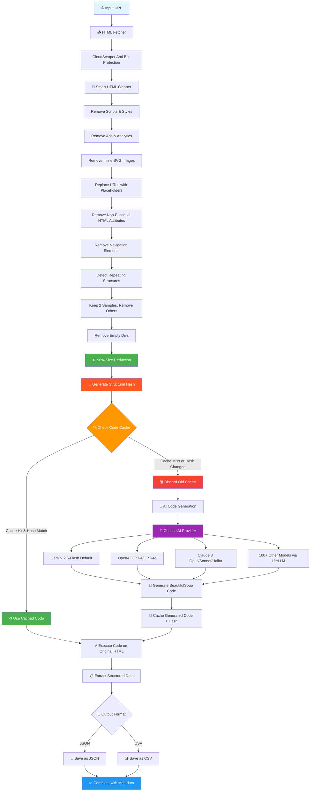

# How BrowseGenie Works

## Table of Contents

- [Pipeline Overview](#pipeline-overview)
- [Live Working Example](#live-working-example)
- [Step-by-Step Breakdown](#step-by-step-breakdown)
- [Smart HTML Cleaner](#smart-html-cleaner)

--------------------------------------------------------------------------

## Pipeline Overview



**Key performance numbers:**

| Metric | Value |
|--------|-------|
| HTML size reduction before AI sees it | **98%+** (e.g. 163 KB → 2.3 KB) |
| AI called per unique page layout | **once** — cached forever after |
| Cost per scrape on repeat runs | **~$0.00786** (~0.7 cents) |
| Cost if raw HTML were sent to AI instead | **57.5× more** (~$0.45 per call) |
| Time to extract hundreds of items | **~5 seconds** |

--------------------------------------------------------------------------

## Live Working Example

Real session scraping 117 laptop products from a live e-commerce site with Gemini 2.5 Pro:

```python
>>> from browsegenie import BrowseGenie
>>> scraper = BrowseGenie(api_key="AIzxxxxxxxxxxxxxxxxxxxxx", model_name="gemini-2.5-pro")
2025-09-17 01:22:30 - code_cache      - INFO - CodeCache initialized with database: temp/extraction_cache.db
2025-09-17 01:22:30 - data_extractor  - INFO - Code caching enabled
2025-09-17 01:22:30 - data_extractor  - INFO - Using Google Gemini API with model: gemini-2.5-pro
2025-09-17 01:22:30 - data_extractor  - INFO - Initialized DataExtractor with model: gemini-2.5-pro

>>> scraper.set_fields(["product_name", "product_price", "product_rating", "product_description", "availability"])
2025-09-17 01:22:31 - browsegenie - INFO - Extraction fields updated: ['product_name', 'product_price', 'product_rating', 'product_description', 'availability']

>>> result = scraper.scrape_url(
...     "https://webscraper.io/test-sites/e-commerce/allinone/computers/laptops",
...     save_to_file=True,
...     format="csv",
... )
2025-09-17 01:22:33 - html_fetcher    - INFO - Successfully fetched content with cloudscraper. Length: 163,496
2025-09-17 01:22:33 - base_cleaner    - INFO - HTML cleaning completed. Original: 150,742 → Final: 2,371
2025-09-17 01:22:33 - base_cleaner    - INFO - Reduction: 98.4%
2025-09-17 01:22:33 - code_cache      - INFO - Cache MISS — generating new extractor
2025-09-17 01:22:33 - data_extractor  - INFO - Generating BeautifulSoup code with gemini-2.5-pro …
2025-09-17 01:22:37 - code_cache      - INFO - Code cached (hash: bd0ed6e62683fcfb…)
2025-09-17 01:22:37 - data_extractor  - INFO - Executing generated extraction code…
2025-09-17 01:22:37 - data_extractor  - INFO - Successfully extracted data with 117 items
>>>

# ✨ 117 laptop products extracted from 163 KB HTML in ~5 seconds
# 🎯 98.4% HTML size reduction (163 KB → 2.3 KB sent to AI)
# 💾 Saved as CSV with product_name, product_price, product_rating, …
```

**What just happened — step by step:**

1. **Fields configured** — `product_name`, `product_price`, `product_rating`, `product_description`, `availability`
2. **HTML fetched** — 163 KB, anti-bot protection handled by cloudscraper
3. **Smart cleaning** — 98.4% reduction, 2.3 KB sent to AI
4. **AI generated** a custom BeautifulSoup4 extractor for those exact fields
5. **Extractor cached** against the page's structural hash — future runs skip the AI call entirely
6. **117 products extracted** from the original (uncleaned) HTML
7. **Saved as CSV** — ready for Excel, pandas, or any analysis tool

--------------------------------------------------------------------------

## Step-by-Step Breakdown

1. **HTML Fetching** — cloudscraper (or selenium as fallback) fetches the page, handling anti-bot measures automatically
2. **Smart HTML Cleaning** — removes 98%+ of noise while preserving the data structure (see below)
3. **Structural Hash** — a fingerprint of the cleaned HTML is computed; if it matches the cache the AI step is skipped entirely
4. **AI Code Generation** — your chosen provider (Gemini, OpenAI, Claude, 100+ via LiteLLM) writes a BeautifulSoup4 extractor for the cleaned HTML; this happens **only on cache miss**
5. **Code Execution** — the cached/generated extractor runs on the **original** (full) HTML to capture every data item
6. **Export** — structured data returned as JSON or CSV with metadata (items extracted, HTML sizes, reduction %)

--------------------------------------------------------------------------

## Smart HTML Cleaner

The cleaner is what makes the token savings possible. It strips everything irrelevant before the AI ever sees the page.

### What gets removed

| What | Why |
|------|-----|
| Scripts & styles | No extraction value, huge size |
| Ads & analytics | Noise |
| Navigation (header, footer, sidebar) | Off-topic for data extraction |
| Meta / SEO tags | Not part of the content |
| Inline SVG images | Bloat — can be thousands of characters each |
| Long URLs | Replaced with short placeholders (`[IMG_URL]`, `[LINK_URL]`) |
| Non-essential attributes | `style`, `onclick`, `data-analytics` removed; `id`, `class`, `href`, `data-price` kept |
| Whitespace between tags | Compresses output before sending to AI |
| Empty `<div>` elements | Recursively removed from innermost out |

### Repeating structure reduction

When a page has 100 product cards, the AI only needs to see 2 to understand the pattern.

- **Pattern detection** — structural hashing + similarity scoring finds repeated elements
- **Smart sampling** — keeps 2 representative samples, removes the rest (e.g. 117 laptop cards → 2 cards sent to AI)
- **Structure preserved** — document flow and parent-child relationships remain intact
- **Result** — AI gets just enough context without being overwhelmed

### Empty element removal

- Starts from the innermost `<div>` and works outward
- Preserves divs that contain text, images, inputs, or interactive elements
- Removes skeleton/placeholder divs like `<div class="animate-pulse"></div>`
