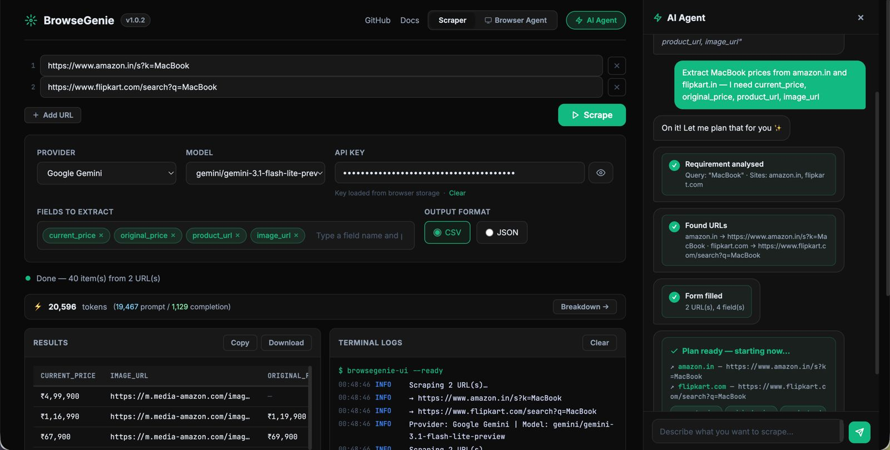
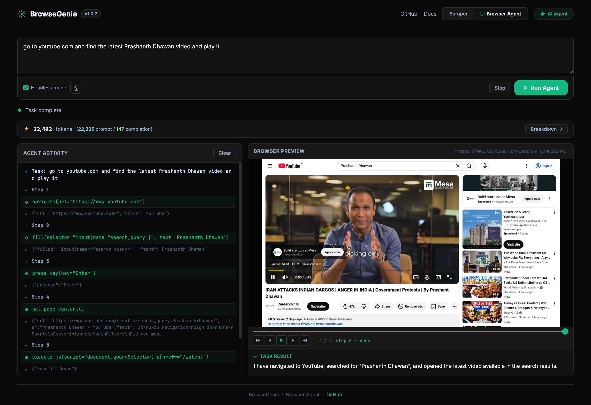

<h1 align="center"> Universal Scraper</h1>

<h2 align="center"> Agentic browser automation and web scraping, just using a prompt</h2>

<p align="center">
<a href="https://www.codefactor.io/repository/github/pushpenderindia/universal-scraper"></a>  
<a href="https://socket.dev/pypi/package/universal-scraper/overview"></a>

<a href="https://codecov.io/gh/pushpenderindia/universal-scraper"></a>
<a href="https://pypi.org/project/universal-scraper/"></a>
<a href="https://pepy.tech/project/universal-scraper?versions=1*&versions=2*&versions=3*"></a>
<a href="https://pepy.tech/project/universal-scraper?versions=1*&versions=2*&versions=3*"></a>
<a href="https://github.com/pushpenderindia/universal-scraper/commits/main"></a>
<a href="#"></a>
</p>

**An AI Agent that can do any kind of browser automation task and web scraping, just using a single prompt.**

Point it at any website, describe what you want — the agent navigates, clicks, scrolls, and extracts the data for you. No scripts. No selectors. No maintenance.

Under the hood the scraping agent writes a custom BeautifulSoup4 extractor for your target page, caches it against a structural hash of the HTML, and reuses that same code on every subsequent run.

**The AI is only ever called once per unique page layout** - not on every scrape - so your token spend stays in the single-digit cents range even across thousands of requests.

When the page layout changes the agent detects it automatically and regenerates the extractor, then caches the new version.

## Table of Contents

- [Web UI - No-Code Mode](#web-ui--no-code-mode)
- [How Universal Scraper Works](HOW_IT_WORKS.md)
- [Installation (Recommended)](#installation-recommended)
- [Installation](#installation)
- [Quick Start](#quick-start)
  - [1. Set up your API key](#1-set-up-your-api-key)
  - [2. Basic Usage](#2-basic-usage)
  - [3. Convenience Function](#3-convenience-function)
  - [4. Browser Agent - browse()](#4-browser-agent---browse)
- [Export Formats](#export-formats)
- [CLI Usage](#cli-usage)
- [MCP Server Usage](#mcp-server-usage)
- [Cache Management](#cache-management)
- [Advanced Usage](#advanced-usage)
- [API Reference](#api-reference)
- [Output Format](#output-format)
- [Common Field Examples](#common-field-examples)
- [Multi-Provider AI Support](#multi-provider-ai-support)
- [Troubleshooting](#troubleshooting)
- [Roadmap](#roadmap)
- [Contributors](#contributors)
- [Contributing](#contributing)
- [License](#license)
- [Changelog](#changelog)

--------------------------------------------------------------------------

## Web UI - No-Code Mode

The fastest way to use Universal Scraper - no Python required. Install the package and launch the local web UI with one command:

```bash
pip install universal-scraper
universal-scraper-ui
```

Your browser opens automatically at `http://127.0.0.1:7860`.



**Browser Agent Mode** - Do any kind of Browser Automation using Prompt!



### What you can do in the UI

| Feature | Details |
|---------|---------|
| **Provider & Model** | Select Google Gemini, OpenAI, Anthropic, or Ollama. Models are fetched **live** from the provider's API when you enter a key - always current, never hardcoded. Falls back to 1,700+ LiteLLM models when no key is entered. Only text/chat models are listed. |
| **API Key auto-fill** | `GEMINI_API_KEY`, `OPENAI_API_KEY`, and `ANTHROPIC_API_KEY` environment variables are pre-filled on page load. |
| **Extraction fields** | Add fields as interactive chips (`product_name`, `price`, `rating` …). Press Enter or comma to add; click × to remove. |
| **Output formats** | **JSON** → syntax-highlighted result. **CSV** → rendered as an HTML table in the browser; download exports a proper `.csv` file. |
| **Real-time logs** | Live terminal-style stream (Server-Sent Events) showing every internal step - fetch, clean, AI call, cache hit - as the scrape runs. |
| **Token usage** | After each scrape a token bar shows total tokens used, prompt/completion split, and cache-hit count. Click **Breakdown →** for a per-API-call modal. |
| **Browser Agent** | Switch to the Browser Agent tab and describe any task in plain English. The agent opens a real Chromium browser, navigates, clicks, and extracts data step-by-step. |
| **Voice input** | Click the mic button in the Browser Agent tab to dictate your task. Live interim transcription appears as you speak; click again to stop. Uses the browser's built-in Web Speech API — no external service required. |
| **Browser Agent token bar** | A live token bar in the Browser Agent tab updates after every LLM call, showing cumulative prompt/completion tokens across all steps. Click **Breakdown →** for a per-call modal. |
| **Screenshot playback** | After a browser agent task completes, a timeline scrubber lets you replay every step frame-by-frame with tool name and step labels. |

### CLI options

```bash
universal-scraper-ui --port 8080        # custom port
universal-scraper-ui --host 0.0.0.0    # bind to all interfaces
universal-scraper-ui --no-browser      # skip auto-opening the browser
```

--------------------------------------------------------------------------

## Why Universal Scraper?

### Traditional scraping and automation is brittle

Writing a scraper the old way means hand-crafting BeautifulSoup4 selectors by reading raw HTML. Browser automation means writing fragile scripts full of hardcoded XPaths and `time.sleep()` calls. The moment a website updates its layout, everything breaks. Teams end up spending more time maintaining scrapers than using the data they collect.

### Universal Scraper fixes this

Universal Scraper is two tools in one:

**1. AI Scraper** — Instead of hard-coded selectors, the agent **generates a custom BeautifulSoup4 extractor on the fly** by analysing a compressed snapshot of the page:

| What happens | The numbers |
|---|---|
| HTML cleaned before AI sees it | **98%+ size reduction** (e.g. 163 KB → 2.3 KB) |
| AI called to write the extractor | **once per unique page layout** |
| Same extractor reused on repeat runs | **$0.00786 per scrape** (~0.7 cents) |
| What would cost with raw HTML sent to AI | **57.5× more tokens**, ~$0.45 per call |
| Time to extract hundreds of items | **~5 seconds** |

When the page layout changes the agent detects the structural difference, regenerates the extractor automatically, and caches the new version — so you never touch the code.

**2. Browser Agent** — Describe any browser task in plain English and the agent handles the rest. It opens a real Chromium browser, reads the live page state, and decides which actions to take — navigate, click, type, scroll, extract — step by step, until the task is complete. No scripts to write, no selectors to maintain. Works on JavaScript-heavy SPAs, login-walled pages, and multi-step workflows that a simple HTTP scraper can never reach.

## How Universal Scraper Works

For a full technical breakdown — pipeline diagram, live working example, HTML cleaner internals, and token cost comparisons — see **[HOW_IT_WORKS.md](HOW_IT_WORKS.md)**.

## Installation (Recommended)

```
pip install universal-scraper
```

## Installation (Global level on Mac)

```
brew install pipx
sudo pipx install "universal-scraper[mcp]" --global
```

## Installation

1. **Clone the repository**:
   ```bash
   git clone <repository-url>
   cd Universal_Scrapper
   ```

2. **Install dependencies**:
   ```bash
   pip install -r requirements.txt
   ```

   Or install manually:
   ```bash
   pip install google-genai beautifulsoup4 requests selenium lxml fake-useragent flask
   ```

3. **Install the module**:
   ```bash
   pip install -e .
   ```

## Quick Start

### 1. Set up your API key

**Option A: Use Gemini (Default - Recommended)**
Get a Gemini API key from [Google AI Studio](https://makersuite.google.com/app/apikey):

```bash
export GEMINI_API_KEY="your_gemini_api_key_here"
```

**Option B: Use OpenAI**
```bash
export OPENAI_API_KEY="your_openai_api_key_here"
```

**Option C: Use Anthropic Claude**
```bash
export ANTHROPIC_API_KEY="your_anthropic_api_key_here"
```

**Option D: Pass API key directly**
```python
# For any provider - just pass the API key directly
scraper = UniversalScraper(api_key="your_api_key")
```

### 2. Basic Usage

```python
from universal_scraper import UniversalScraper

# Option 1: Auto-detect provider (uses Gemini by default)
scraper = UniversalScraper(api_key="your_gemini_api_key")

# Option 2: Specify Gemini model explicitly
scraper = UniversalScraper(api_key="your_gemini_api_key", model_name="gemini-3.1-flash-lite-preview")

# Option 3: Use OpenAI
scraper = UniversalScraper(api_key="your_openai_api_key", model_name="gpt-4")

# Option 4: Use Anthropic Claude
scraper = UniversalScraper(api_key="your_anthropic_api_key", model_name="claude-3-sonnet-20240229")

# Option 5: Use any other provider supported by LiteLLM
scraper = UniversalScraper(api_key="your_api_key", model_name="llama-2-70b-chat")

# Set the fields you want to extract
scraper.set_fields([
    "company_name", 
    "job_title", 
    "apply_link", 
    "salary_range",
    "location"
])

# Check current model
print(f"Using model: {scraper.get_model_name()}")

# Scrape a URL (default JSON format)
result = scraper.scrape_url("https://example.com/jobs", save_to_file=True)

print(f"Extracted {result['metadata']['items_extracted']} items")
print(f"Data saved to: {result.get('saved_to')}")

# Scrape and save as CSV
result = scraper.scrape_url("https://example.com/jobs", save_to_file=True, format='csv')
print(f"CSV data saved to: {result.get('saved_to')}")
```

### 3. Convenience Function

For quick one-off scraping:

```python
from universal_scraper import scrape

# Quick scraping with default JSON format
data = scrape(
    url="https://example.com/jobs",
    api_key="your_gemini_api_key",
    fields=["company_name", "job_title", "apply_link"]
)

# Quick scraping with CSV format
data = scrape(
    url="https://example.com/jobs",
    api_key="your_gemini_api_key",
    fields=["company_name", "job_title", "apply_link"],
    format="csv"
)

# Quick scraping with OpenAI
data = scrape(
    url="https://example.com/jobs",
    api_key="your_openai_api_key",
    fields=["company_name", "job_title", "apply_link"],
    model_name="gpt-4"
)

# Quick scraping with Anthropic Claude
data = scrape(
    url="https://example.com/jobs",
    api_key="your_anthropic_api_key",
    fields=["company_name", "job_title", "apply_link"],
    model_name="claude-3-haiku-20240307"
)

print(data['data'])  # The extracted data
```

### 4. Browser Agent - `browse()`

Run any browser automation task from code — the same capability available in the web UI, as a single function call.

```python
from universal_scraper import browse

result = browse(
    task="Go to news.ycombinator.com and return the top 5 story titles",
    api_key="your_gemini_api_key",
    model_name="gemini-3.1-flash-lite-preview",
)

print(result["summary"])   # Agent's summary of what it did
print(result["data"])      # Structured data extracted by the agent
print(result["steps"])     # Number of steps taken
print(result["success"])   # True if completed successfully
```

Logs are printed automatically so you can follow along in real time:


**With OpenAI or Anthropic** — provider is auto-detected from the model name:

```python
# OpenAI
result = browse(
    task="Search PyPI for 'httpx' and return the latest version number",
    api_key="your_openai_api_key",
    model_name="gpt-4o",
)

# Anthropic Claude
result = browse(
    task="Go to example.com and return the page heading",
    api_key="your_anthropic_api_key",
    model_name="claude-3-5-sonnet-20241022",
)
```

**Silent mode** — suppress all logs:

```python
result = browse(
    task="...",
    api_key="your_api_key",
    model_name="gemini-3.1-flash-lite-preview",
    show_logs=False,
)
```

**Stream events** — receive real-time events via callback:

```python
def on_event(event_type, data):
    if event_type == "screenshot":
        # data["image"] is a base64 JPEG
        save_screenshot(data["image"])
    elif event_type == "tool_call":
        print(f"Agent called: {data['tool']}")

result = browse(
    task="Go to github.com/trending and extract the top 3 repos",
    api_key="your_gemini_api_key",
    model_name="gemini-3.1-flash-lite-preview",
    on_event=on_event,
)
```

**Visible browser + timeout:**

```python
result = browse(
    task="Log in to example.com with user@test.com / pass123 and click Submit",
    api_key="your_gemini_api_key",
    model_name="gemini-3.1-flash-lite-preview",
    headless=False,   # Watch the browser in action
    timeout=120,      # Stop after 2 minutes
)
```

**Return value:**

| Key | Type | Description |
|-----|------|-------------|
| `summary` | `str` | Text summary the agent produced when done |
| `data` | `dict` | Structured data extracted by the agent |
| `screenshots` | `list` | All screenshot frames captured during the run |
| `steps` | `int` | Number of steps the agent took |
| `success` | `bool` | `True` if task completed, `False` on error/timeout |
| `error` | `str\|None` | Error message if `success` is `False` |

**Parameters:**

| Parameter | Type | Default | Description |
|-----------|------|---------|-------------|
| `task` | `str` | required | Plain-English description of what to do |
| `api_key` | `str` | required | AI provider API key |
| `model_name` | `str` | required | Model name — provider auto-detected |
| `provider` | `str` | auto | Override provider (`google`, `openai`, `anthropic`, …) |
| `headless` | `bool` | `True` | Run browser headlessly |
| `on_event` | `callable` | `None` | Callback for real-time events |
| `timeout` | `float` | `None` | Max seconds before stopping |
| `show_logs` | `bool` | `True` | Print progress logs to stdout |

## Export Formats

Universal Scraper supports multiple output formats to suit your data processing needs:

### JSON Export (Default)
```python
# JSON is the default format
result = scraper.scrape_url("https://example.com/jobs", save_to_file=True)
# or explicitly specify
result = scraper.scrape_url("https://example.com/jobs", save_to_file=True, format='json')
```

**JSON Output Structure:**
```json
{
  "url": "https://example.com",
  "timestamp": "2025-01-01T12:00:00",
  "fields": ["company_name", "job_title", "apply_link"],
  "data": [
    {
      "company_name": "Example Corp",
      "job_title": "Software Engineer", 
      "apply_link": "https://example.com/apply/123"
    }
  ],
  "metadata": {
    "raw_html_length": 50000,
    "cleaned_html_length": 15000,
    "items_extracted": 1
  }
}
```

### CSV Export
```python
# Export as CSV for spreadsheet analysis
result = scraper.scrape_url("https://example.com/jobs", save_to_file=True, format='csv')
```

**CSV Output:**
- Clean tabular format with headers
- All fields as columns, missing values filled with empty strings
- Perfect for Excel, Google Sheets, or pandas processing
- Automatically handles varying field structures across items

### Multiple URLs with Format Choice
```python
urls = ["https://site1.com", "https://site2.com", "https://site3.com"]

# Save all as JSON (default)
results = scraper.scrape_multiple_urls(urls, save_to_files=True)

# Save all as CSV
results = scraper.scrape_multiple_urls(urls, save_to_files=True, format='csv')
```

### CLI Usage

```bash
# Gemini (default) - auto-detects from environment
universal-scraper https://example.com/jobs --output jobs.json

# OpenAI GPT models
universal-scraper https://example.com/products --api-key YOUR_OPENAI_KEY --model gpt-4 --format csv

# Anthropic Claude models  
universal-scraper https://example.com/data --api-key YOUR_ANTHROPIC_KEY --model claude-3-haiku-20240307

# Custom fields extraction
universal-scraper https://example.com/listings --fields product_name product_price product_rating

# Batch processing multiple URLs
universal-scraper --urls urls.txt --output-dir results --format csv --model gpt-4o-mini

# Verbose logging with any provider
universal-scraper https://example.com --api-key YOUR_KEY --model gpt-4 --verbose
```

**🔧 Advanced CLI Options:**
```bash
# Set custom extraction fields
universal-scraper URL --fields title price description availability

# Use environment variables (auto-detected)
export OPENAI_API_KEY="your_key"
universal-scraper URL --model gpt-4

# Multiple output formats
universal-scraper URL --format json    # Default
universal-scraper URL --format csv     # Spreadsheet-ready

# Batch processing
echo -e "https://site1.com\nhttps://site2.com" > urls.txt
universal-scraper --urls urls.txt --output-dir batch_results
```

**🔗 Provider Support**: All 100+ models supported by LiteLLM work in CLI! See [LiteLLM Providers](https://docs.litellm.ai/docs/providers) for complete list.

**Development Usage** (from cloned repo):
```bash
python main.py https://example.com/jobs --api-key YOUR_KEY --model gpt-4
```

## MCP Server Usage

Universal Scraper works as an MCP (Model Context Protocol) server, allowing AI assistants to scrape websites directly.

### Quick Setup

1. **Install with MCP support:**
```bash
pip install universal-scraper
```

2. **Set your AI API key:**
```bash
export GEMINI_API_KEY="your_key"  # or OPENAI_API_KEY, ANTHROPIC_API_KEY
```

### Claude Code Setup

Add this to your Claude Code MCP settings:

```json
{
  "mcpServers": {
    "universal-scraper": {
      "command": "universal-scraper-mcp"
    }
  }
}
```

or Run this command in your terminal

```
claude mcp add universal-scraper universal-scraper-mcp
```


### Cursor Setup

Add this to your Cursor MCP configuration:

```json
{
  "mcpServers": {
    "universal-scraper": {
      "command": "universal-scraper-mcp"
    }
  }
}
```

### Available Tools

- **scrape_url**: Scrape a single URL
- **scrape_multiple_urls**: Scrape multiple URLs
- **configure_scraper**: Set API keys and models
- **get_scraper_info**: Check current settings
- **clear_cache**: Clear cached data

### Example Usage

Once configured, just ask your AI assistant:

> "Scrape https://news.ycombinator.com and extract the top story titles and links"

> "Scrape this product page and get the price, name, and reviews"

## Cache Management
```python
scraper = UniversalScraper(api_key="your_key")

# View cache statistics
stats = scraper.get_cache_stats()
print(f"Cached entries: {stats['total_entries']}")
print(f"Total cache hits: {stats['total_uses']}")

# Clear old entries (30+ days)
removed = scraper.cleanup_old_cache(30)
print(f"Removed {removed} old entries")

# Clear entire cache
scraper.clear_cache()

# Disable/enable caching
scraper.disable_cache()  # For testing
scraper.enable_cache()   # Re-enable
```

## Advanced Usage

### Multiple URLs

```python
scraper = UniversalScraper(api_key="your_api_key")
scraper.set_fields(["title", "price", "description"])

urls = [
    "https://site1.com/products",
    "https://site2.com/items", 
    "https://site3.com/listings"
]

# Scrape all URLs and save as JSON (default)
results = scraper.scrape_multiple_urls(urls, save_to_files=True)

# Scrape all URLs and save as CSV for analysis
results = scraper.scrape_multiple_urls(urls, save_to_files=True, format='csv')

for result in results:
    if result.get('error'):
        print(f"Failed {result['url']}: {result['error']}")
    else:
        print(f"Success {result['url']}: {result['metadata']['items_extracted']} items")
```

### Custom Configuration

```python
scraper = UniversalScraper(
    api_key="your_api_key",
    temp_dir="custom_temp",      # Custom temporary directory
    output_dir="custom_output",  # Custom output directory  
    log_level=logging.DEBUG,     # Enable debug logging
    model_name="gpt-4"           # Custom model (OpenAI, Gemini, Claude, etc.)
)

# Configure for e-commerce scraping
scraper.set_fields([
    "product_name",
    "product_price", 
    "product_rating",
    "product_reviews_count",
    "product_availability",
    "product_description"
])

# Check and change model dynamically
print(f"Current model: {scraper.get_model_name()}")
scraper.set_model_name("gpt-4")  # Switch to OpenAI
print(f"Switched to: {scraper.get_model_name()}")

# Or switch to Claude
scraper.set_model_name("claude-3-sonnet-20240229")
print(f"Switched to: {scraper.get_model_name()}")

result = scraper.scrape_url("https://ecommerce-site.com", save_to_file=True)
```

## API Reference

### UniversalScraper Class

#### Constructor
```python
UniversalScraper(api_key=None, temp_dir="temp", output_dir="output", log_level=logging.INFO, model_name=None)
```

- `api_key`: AI provider API key (auto-detects provider, or set specific env vars)
- `temp_dir`: Directory for temporary files
- `output_dir`: Directory for output files
- `log_level`: Logging level
- `model_name`: AI model name (default: 'gemini-3.1-flash-lite-preview', supports 100+ models via LiteLLM)
  - See [LiteLLM Providers](https://docs.litellm.ai/docs/providers) for complete model list and setup

#### Methods

- `set_fields(fields: List[str])`: Set the fields to extract
- `get_fields() -> List[str]`: Get current fields configuration
- `get_model_name() -> str`: Get current Gemini model name
- `set_model_name(model_name: str)`: Change the Gemini model
- `scrape_url(url: str, save_to_file=False, output_filename=None, format='json') -> Dict`: Scrape a single URL
- `scrape_multiple_urls(urls: List[str], save_to_files=True, format='json') -> List[Dict]`: Scrape multiple URLs

### Convenience Functions

#### `scrape()`
```python
scrape(url: str, api_key: str, fields: List[str], model_name: Optional[str] = None, format: str = 'json') -> Dict
```

Quick scraping function for simple use cases. Auto-detects AI provider from API key pattern.

#### `browse()`
```python
browse(
    task: str,
    api_key: str,
    model_name: str,
    provider: Optional[str] = None,
    headless: bool = True,
    on_event: Optional[Callable] = None,
    timeout: Optional[float] = None,
    show_logs: bool = True,
) -> Dict
```

Run a browser automation task. The agent opens a real Chromium browser, navigates, clicks, scrolls, and extracts data based on the plain-English `task` description. Provider is auto-detected from `model_name`. Returns a dict with `summary`, `data`, `screenshots`, `steps`, `success`, and `error`.

**Note**: For model names and provider-specific setup, refer to the [LiteLLM Providers Documentation](https://docs.litellm.ai/docs/providers).

## Output Format

The scraped data is returned in a structured format:

```json
{
  "url": "https://example.com",
  "timestamp": "2025-01-01T12:00:00",
  "fields": ["company_name", "job_title", "apply_link"],
  "data": [
    {
      "company_name": "Example Corp",
      "job_title": "Software Engineer", 
      "apply_link": "https://example.com/apply/123"
    }
  ],
  "metadata": {
    "raw_html_length": 50000,
    "cleaned_html_length": 15000,
    "items_extracted": 1
  }
}
```

## Common Field Examples

### Job Listings
```python
scraper.set_fields([
    "company_name",
    "job_title", 
    "apply_link",
    "salary_range",
    "location",
    "job_description",
    "employment_type",
    "experience_level"
])
```

### E-commerce Products
```python
scraper.set_fields([
    "product_name",
    "product_price",
    "product_rating", 
    "product_reviews_count",
    "product_availability",
    "product_image_url",
    "product_description"
])
```

### News Articles
```python
scraper.set_fields([
    "article_title",
    "article_content",
    "article_author",
    "publish_date", 
    "article_url",
    "article_category"
])
```

## Multi-Provider AI Support

Universal Scraper now supports multiple AI providers through LiteLLM integration:

### Supported Providers
- **Google Gemini** (Default): `gemini-3.1-flash-lite-preview`, `gemini-1.5-pro`, etc.
- **OpenAI**: `gpt-4`, `gpt-4-turbo`, `gpt-3.5-turbo`, etc.
- **Anthropic**: `claude-3-opus-20240229`, `claude-3-sonnet-20240229`, `claude-3-haiku-20240307`
- **100+ Other Models**: Via LiteLLM including Llama, PaLM, Cohere, and more

**For complete model names and provider setup**: See [LiteLLM Providers Documentation](https://docs.litellm.ai/docs/providers)

### Usage Examples

```python
# Gemini (Default - Free tier available)
scraper = UniversalScraper(api_key="your_gemini_key")
# Auto-detects as gemini-3.1-flash-lite-preview

# OpenAI
scraper = UniversalScraper(api_key="sk-...", model_name="gpt-4")

# Anthropic Claude
scraper = UniversalScraper(api_key="sk-ant-...", model_name="claude-3-haiku-20240307")

# Environment variable approach
# Set GEMINI_API_KEY, OPENAI_API_KEY, or ANTHROPIC_API_KEY
scraper = UniversalScraper()  # Auto-detects from env vars

# Any other provider from LiteLLM (see link above for model names)
scraper = UniversalScraper(api_key="your_api_key", model_name="llama-2-70b-chat")
```

### Model Configuration Guide

**Quick Reference for Popular Models:**
```python
# Gemini Models
model_name="gemini-3.1-flash-lite-preview"        # Fast, efficient
model_name="gemini-1.5-pro"          # More capable

# OpenAI Models  
model_name="gpt-4"                   # Most capable
model_name="gpt-4o-mini"             # Fast, cost-effective
model_name="gpt-3.5-turbo"           # Legacy but reliable

# Anthropic Models
model_name="claude-3-opus-20240229"      # Most capable
model_name="claude-3-sonnet-20240229"    # Balanced
model_name="claude-3-haiku-20240307"     # Fast, efficient

# Other Popular Models (see LiteLLM docs for setup)
model_name="llama-2-70b-chat"        # Meta Llama
model_name="command-nightly"          # Cohere
model_name="palm-2-chat-bison"        # Google PaLM
```

**🔗 Complete Model List**: Visit [LiteLLM Providers Documentation](https://docs.litellm.ai/docs/providers) for:
- All available model names
- Provider-specific API key setup
- Environment variable configuration
- Rate limits and pricing information

### Model Auto-Detection
If you don't specify a model, the scraper automatically selects:
- **Gemini**: If `GEMINI_API_KEY` is set or API key contains "AIza"
- **OpenAI**: If `OPENAI_API_KEY` is set or API key starts with "sk-"
- **Anthropic**: If `ANTHROPIC_API_KEY` is set or API key starts with "sk-ant-"

## Troubleshooting

### Common Issues

1. **API Key Error**: Make sure your API key is valid and set correctly:
   - Gemini: Set `GEMINI_API_KEY` or pass directly
   - OpenAI: Set `OPENAI_API_KEY` or pass directly
   - Anthropic: Set `ANTHROPIC_API_KEY` or pass directly
2. **Model Not Found**: Ensure you're using the correct model name for your provider
3. **Empty Results**: The AI might need more specific field names or the page might not contain the expected data
4. **Network Errors**: Some sites block scrapers - the tool uses cloudscraper to handle most cases
5. **Model Name Issues**: Check [LiteLLM Providers](https://docs.litellm.ai/docs/providers) for correct model names and setup instructions

### Debug Mode

Enable debug logging to see what's happening:

```python
import logging
scraper = UniversalScraper(api_key="your_key", log_level=logging.DEBUG)
```

## Roadmap

See [ROADMAP.md](ROADMAP.md) for planned features and improvements.

## Contributors

[Contributors List](https://github.com/pushpenderindia/universal-scraper/graphs/contributors)

## Contributing

1. Fork the repository
2. Create a feature branch
3. Make your changes
4. Run `pytest` to run testcases
5. Test PEP Standard: 

```
flake8 universal_scraper/ --count --select=E9,F63,F7,F82 --show-source --statistics

flake8 universal_scraper/ --count --exit-zero --max-complexity=10 --max-line-length=127 --statistics
```

6. Submit a pull request

## License

GPT 3.0 License - see LICENSE file for details.

## Changelog

See [CHANGELOG.md](CHANGELOG.md) for detailed version history and release notes.
